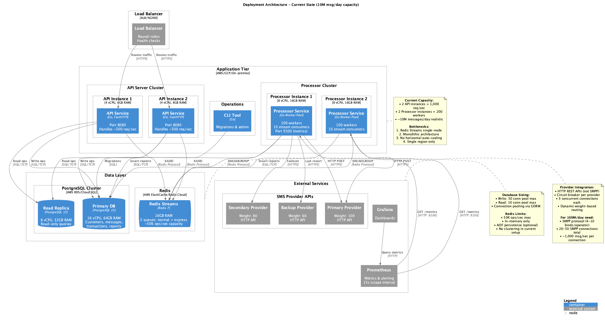

# C4 Model - SMS Gateway

High-performance SMS routing system with intelligent multi-provider delivery, built in Go.

## Stack

- **Go** - Goroutine concurrency
- **FastHTTP** - 6x faster than net/http
- **Redis Streams** - At-least-once delivery queue
- **PostgreSQL** - Read/write split
- **Prometheus** - Metrics

Independent API and Processor services enable horizontal scaling and fault isolation.

## Level 1: System Context Diagram


<details>
<summary>PlantUML Source</summary>

```plantuml
@startuml
!include https://raw.githubusercontent.com/plantuml-stdlib/C4-PlantUML/master/C4_Context.puml

LAYOUT_WITH_LEGEND()

title System Context Diagram - SMS Gateway

Person(customer, "Customer", "End user who needs to send SMS messages")
Person(admin, "System Administrator", "Manages and monitors the system")

System(sms_gateway, "SMS Gateway", "High-performance SMS routing and delivery system with intelligent provider management")

System_Ext(sms_provider_1, "Primary SMS Provider", "External SMS service provider")
System_Ext(sms_provider_2, "Secondary SMS Provider", "Backup SMS service provider")
System_Ext(sms_provider_3, "Backup SMS Provider", "Tertiary SMS service provider")

System_Ext(monitoring, "Prometheus/Grafana", "Monitoring and metrics visualization")

Rel(customer, sms_gateway, "Submits SMS messages via", "HTTPS/REST API")
Rel(sms_gateway, sms_provider_1, "Sends SMS via", "HTTPS")
Rel(sms_gateway, sms_provider_2, "Sends SMS via (failover)", "HTTPS")
Rel(sms_gateway, sms_provider_3, "Sends SMS via (failover)", "HTTPS")
Rel(admin, sms_gateway, "Manages migrations, monitors", "CLI")
Rel(monitoring, sms_gateway, "Scrapes metrics from", "HTTP")

@enduml
```

</details>

**External Actors:**

- **Customers / Client Applications**: Make HTTP requests to create new messages and query their status. Supply customer ID and message content; expect reliable delivery to recipients.

- **SMS Providers (Operators)**: External SMS services accessed via HTTP. The gateway forwards messages to one of several providers using intelligent routing.

- **Operations / Monitoring**: Prometheus scrapes the `/metrics` endpoint exposed by the processor on port 9100 to monitor throughput, latency, and success rates.

- **Administrators**: Use the CLI tool to run database migrations and perform maintenance tasks.

**Internal Infrastructure:**

- **API Service**: FastHTTP-based REST API for message submission
- **Processor Service**: Consumes queued messages and delivers to providers
- **PostgreSQL**: Persistent storage (customers, messages, transactions, delivery reports)
- **Redis Streams**: Low-latency message queue with at-least-once delivery semantics
- **CLI Tool**: Command-line utility for database migrations using goose

---

## Level 2: Container Diagram


<details>
<summary>PlantUML Source</summary>

```plantuml
@startuml
!include https://raw.githubusercontent.com/plantuml-stdlib/C4-PlantUML/master/C4_Container.puml

LAYOUT_WITH_LEGEND()

title Container Diagram - SMS Gateway

Person(customer, "Customer", "Sends SMS messages")
Person(admin, "Administrator")

System_Boundary(sms_gateway, "SMS Gateway") {
    Container(api_server, "API Server", "Go, FastHTTP", "REST API for message submission, runs on port 8080")
    Container(processor, "Processor", "Go", "Consumes queue and sends messages to providers")
    Container(cli, "CLI Tool", "Go", "Database migrations and admin tasks")
    Container(operator_mock, "Operator Mock", "Go, FastHTTP", "Test SMS provider simulator")

    ContainerDb(postgres_write, "PostgreSQL (Write)", "PostgreSQL", "Stores customers, messages, transactions, delivery reports")
    ContainerDb(postgres_read, "PostgreSQL (Read)", "PostgreSQL", "Read replica for queries")
    ContainerQueue(redis, "Redis Streams", "Redis", "Message queues (normal + express)")
}

System_Ext(sms_providers, "SMS Providers", "External SMS services")
System_Ext(prometheus, "Prometheus", "Metrics collection")

Rel(customer, api_server, "POST /api/v1/messages", "HTTPS")
Rel(api_server, postgres_write, "Creates messages, updates balance", "SQL")
Rel(api_server, postgres_read, "Validates customer", "SQL")
Rel(api_server, redis, "Enqueues messages", "Redis Streams")

Rel(processor, redis, "Consumes messages", "Redis Streams")
Rel(processor, postgres_write, "Records delivery reports", "SQL")
Rel(processor, postgres_read, "Reads message data", "SQL")
Rel(processor, sms_providers, "Sends SMS", "HTTPS")

Rel(admin, cli, "Runs migrations", "CLI")
Rel(cli, postgres_write, "Executes migrations", "SQL")

Rel(prometheus, processor, "Scrapes /metrics", "HTTP :9100")

Rel_Back(operator_mock, processor, "Test provider", "HTTPS")

@enduml
```

</details>

### API Service

**Responsibility**: Exposes REST endpoints for message operations. Validates requests, normalizes phone numbers, and persists data. When a message is created, it atomically deducts credits from customer balance, stores the message and transaction record, then enqueues to Redis Streams for asynchronous processing.

**Technology**: FastHTTP server (up to 6x faster than net/http), GORM for PostgreSQL, Redis Streams queue client.

**Endpoints**:
- `POST /api/v1/messages` - Create normal priority message
- `POST /api/v1/messages/express` - Create high-priority message
- `GET /api/v1/messages` - List messages
- `GET /api/v1/messages/delivery-reports` - List messages with delivery reports
- `GET /api/v1/health` - Health check

### Processor Service

**Responsibility**: Consumes messages from Redis Streams and delivers to external SMS providers. Manages multiple consumer goroutines (configurable parallelism), applies processing timeouts, and tracks metrics. Uses intelligent provider selection based on weight, success rate, and latency. Implements circuit breaker to avoid calling failing providers. Records delivery reports in database.

**Technology**: ProcessorService with multiple consumer instances, Gateway Client with metrics-based routing, Prometheus metrics exporter.

**Interfaces**:
- Consumes from Redis Streams (XREAD, XACK, XNACK)
- Writes delivery reports to PostgreSQL
- Sends HTTP POST to external SMS providers
- Exposes `/metrics` endpoint on port 9100

### Data Stores

**PostgreSQL**:
- **Write connection**: Stores customers, messages, transactions, delivery reports
- **Read connection**: Can point to read replica for queries
- **Transactions**: Atomic balance deductions with retry logic
- **Tables**: `customers`, `messages`, `transactions`, `delivery_reports`

**Redis Streams**:
- **At-least-once delivery**: Consumer groups ensure messages are processed
- **ACK/NACK semantics**: Successful processing ACKs message; failures NACK for retry
- **Dead Letter Queue (DLQ)**: Failed messages after max retries move to DLQ
- **Dual queues**: Normal (`sms:queue:normal`) and express (`sms:queue:express`) for priority handling
- **Visibility timeout**: Pending messages reclaimed after timeout
- **Low latency**: In-memory operations provide sub-millisecond queue latency

### CLI Tool

**Responsibility**: Database migration capabilities using goose wrapper. Executes SQL migration files in `migrations/` directory.

**Usage**: `go run ./cmd/cli --env=.env --dir=./migrations`

### Operator Mock (Development Only)

**Responsibility**: Simulates external SMS provider for testing. Exposes endpoints for SMS send, status check, and configuration. Introduces artificial delays and error codes to mimic real-world behavior.

**Not used in production** - Only for local development and integration testing.

---

## Level 3: Component Diagram - API Server


<details>
<summary>PlantUML Source</summary>

```plantuml
@startuml
!include https://raw.githubusercontent.com/plantuml-stdlib/C4-PlantUML/master/C4_Component.puml

LAYOUT_WITH_LEGEND()

title Component Diagram - API Server

Container_Boundary(api_server, "API Server") {
    Component(router, "FastHTTP Router", "fasthttp/router", "Routes HTTP requests")
    Component(middleware, "Middleware Stack", "pkg/http", "Compression, timeout, logging, recovery")
    Component(message_handler, "Message Handler", "handlers", "Handles message creation requests")
    Component(message_service, "Message Service", "services", "Business logic for message operations")
    Component(customer_repo, "Customer Repository", "repository", "Customer data access")
    Component(message_repo, "Message Repository", "repository", "Message data access")
    Component(transaction_repo, "Transaction Repository", "repository", "Transaction data access")
    Component(queue_client, "Queue Client", "queue", "Redis Streams wrapper")
    Component(config, "Config", "config", "Environment-based configuration")
}

ContainerDb(postgres_read, "PostgreSQL (Read)")
ContainerDb(postgres_write, "PostgreSQL (Write)")
ContainerQueue(redis, "Redis Streams")

Rel(router, middleware, "Applies middleware")
Rel(middleware, message_handler, "Routes to handler")
Rel(message_handler, message_service, "Delegates business logic")
Rel(message_service, customer_repo, "Validates balance")
Rel(message_service, message_repo, "Creates message")
Rel(message_service, transaction_repo, "Records transaction")
Rel(message_service, queue_client, "Enqueues message")

Rel(customer_repo, postgres_read, "SELECT", "GORM")
Rel(message_repo, postgres_write, "INSERT", "GORM")
Rel(transaction_repo, postgres_write, "INSERT", "GORM")
Rel(queue_client, redis, "XADD", "go-redis")

Rel(message_handler, config, "Reads")
Rel(message_service, config, "Reads")

@enduml
```

</details>

**Components:**

- **Router & Middleware**: FastHTTP router with middleware stack
  - Compression (level 6 gzip)
  - Request timeout (5 seconds)
  - Request logging with structured logs
  - Panic recovery with stack traces

- **Handlers**:
  - `MessageHandler`: Creates and lists messages, validates JSON requests
  - `HealthHandler`: Returns service health status
  - Use FastHTTP `RequestCtx` (not standard `http.ResponseWriter`)

- **Services**:
  - `MessageService`: Business logic for message operations
  - Validates non-empty content and mobile numbers
  - Executes atomic transactions: deduct balance → create message → log transaction → enqueue
  - Optional phone number normalizer

- **Repositories** (GORM-based):
  - `CustomerRepository`: Atomic balance updates with retry logic, uses `WithinTransaction()`
  - `MessageRepository`: Create and list messages, aggregate with delivery reports
  - `TransactionRepository`: Write transaction records for billing

- **Queue Client**:
  - Abstracts Redis Streams (XADD for publish)
  - Two queue instances: normal and express
  - Configurable consumer groups, visibility timeout, DLQ support

- **Configuration & Logging**:
  - Environment variable loader (`github.com/Netflix/go-env`)
  - Structured logging (zerolog/zap wrapper)

---

## Level 3: Component Diagram - Processor


<details>
<summary>PlantUML Source</summary>

```plantuml
@startuml
!include https://raw.githubusercontent.com/plantuml-stdlib/C4-PlantUML/master/C4_Component.puml

LAYOUT_WITH_LEGEND()

title Component Diagram - Processor

Container_Boundary(processor, "Processor") {
    Component(worker_pool, "Worker Pool", "pkg/worker", "Concurrent message processing")
    Component(sms_processor, "SMS Processor", "processor", "Coordinates message processing")
    Component(gateway_client, "Gateway Client", "gateways", "Multi-provider HTTP client with circuit breaker")
    Component(provider_selector, "Provider Selector", "gateways", "Weight-based + performance-based routing")
    Component(circuit_breaker, "Circuit Breaker", "gateways", "Failure detection and provider disable")
    Component(health_checker, "Health Checker", "gateways", "Background provider health checks")
    Component(delivery_repo, "Delivery Report Repository", "repository", "Delivery report data access")
    Component(queue_consumer, "Queue Consumer", "queue", "Redis Streams consumer with ack/nack")
    Component(metrics, "Prometheus Metrics", "pkg/prom", "Request count, latency, success rate")
}

ContainerDb(postgres_write, "PostgreSQL (Write)")
ContainerQueue(redis, "Redis Streams")
System_Ext(sms_providers, "SMS Providers")
System_Ext(prometheus, "Prometheus")

Rel(queue_consumer, redis, "XREAD, XACK, XNACK", "go-redis")
Rel(queue_consumer, worker_pool, "Dispatches messages")
Rel(worker_pool, sms_processor, "Processes")
Rel(sms_processor, gateway_client, "Send SMS")
Rel(gateway_client, provider_selector, "Selects best provider")
Rel(provider_selector, circuit_breaker, "Checks provider status")
Rel(gateway_client, sms_providers, "HTTP POST", "FastHTTP")
Rel(sms_processor, delivery_repo, "Records report")
Rel(delivery_repo, postgres_write, "INSERT", "GORM")
Rel(health_checker, sms_providers, "Health check", "FastHTTP")
Rel(health_checker, circuit_breaker, "Updates status")

Rel(gateway_client, metrics, "Records metrics")
Rel(metrics, prometheus, "Exposes :9100/metrics", "HTTP")

@enduml
```

</details>

**Components:**

- **ProcessorService**: Main orchestrator
  - Spawns configurable number of consumer goroutines (default: 10)
  - Reads from Redis Streams and delegates to processors
  - Periodically collects internal metrics (success/failure counts, avg processing time)
  - Performs health checks on Redis and queue lag

- **SMSMessageProcessor**: Implements `Processor` interface
  - Deserializes message from queue
  - Builds `SendRequest` for gateway client
  - Records delivery reports on success
  - Returns errors for retry on failure
  - Updates Prometheus histogram metrics

- **Gateway Client**: Intelligent multi-provider HTTP client
  - Maintains per-provider metrics (success count, error count, latency history)
  - Selects best provider using score: `weight × successRate × (1 - normalizedLatency)`
  - FastHTTP client with 4KB buffers

- **Provider Selector**:
  - Ranks providers by calculated score
  - Default weights: Primary=100, Secondary=80, Backup=60
  - Filters out providers with open circuit breaker

- **Circuit Breaker**: Failure protection pattern
  - **Closed state**: Normal operation, requests pass through
  - **Open state**: Provider disabled after threshold failures exceeded
  - **Half-Open state**: After timeout, limited requests test recovery
  - Prevents cascading failures to unhealthy providers

- **Health Checker**:
  - Background goroutine for periodic provider health checks
  - Tests disabled providers to re-enable after recovery
  - Updates circuit breaker state based on health results

- **ServiceMetrics & Health Monitor**:
  - Tracks total processed and failed messages
  - Computes processing rate (messages/second)
  - Average processing duration
  - Periodically logs metrics for debugging

- **DeliveryReportRepository**: Writes delivery reports to PostgreSQL via GORM

- **Prometheus Metrics Exporter**:
  - Counters: Total requests, successes, failures per provider
  - Histograms: Request latency, processing duration
  - Exposes `/metrics` endpoint on port 9100

---

## Level 4: Code Diagram - Gateway Client Flow


<details>
<summary>PlantUML Source</summary>


</details>

**Algorithm:**
1. **Rank providers** by score: `weight × successRate × (1 - normalizedLatency)`
2. **Filter** providers with open circuit breaker
3. **Select** highest-scoring available provider
4. **Send** HTTP request with 4KB buffer
5. **Record** metrics (success/failure, latency)
6. **Circuit breaker** disables provider if failures exceed threshold
7. **Health checker** periodically tests disabled providers to re-enable

---

## Level 4: Code Diagram - Queue Implementation


<details>
<summary>PlantUML Source</summary>


</details>

**Implementation:**

- **At-least-once delivery**: Consumer groups ensure messages are processed at least once
- **ACK/NACK semantics**:
  - `Ack()` - Confirms successful processing, removes from pending
  - `Nack()` - Increments attempt counter, requeues or moves to DLQ if max retries exceeded
- **Visibility timeout**: Pending messages become visible for reclaim after timeout
- **Dead Letter Queue**: Failed messages after `MaxRetries` moved to DLQ for manual inspection
- **Redis Streams commands**:
  - `XADD` - Publish message to stream
  - `XREADGROUP` - Consume messages with blocking
  - `XACK` - Acknowledge processed message
  - `XPENDING` - List messages pending acknowledgment
  - `XCLAIM` - Claim stuck messages for reprocessing

---

## Level 4: Code Diagram - Gateway Client Classes


<details>
<summary>PlantUML Source</summary>


</details>

**Circuit Breaker State Machine:**


<details>
<summary>PlantUML Source</summary>


</details>

**Provider Score Calculation:**

```go
normalizedLatency := (avgLatency - minLatency) / (maxLatency - minLatency)
score := weight × successRate × (1.0 - normalizedLatency)
```

Where:
- `weight`: Provider priority (primary=100, secondary=80, backup=60)
- `successRate`: `successfulReqs / totalRequests`
- `normalizedLatency`: Latency normalized to 0-1 range across all providers

**Health Checker:**
- Runs background goroutine at configurable interval (e.g., 30 seconds)
- Tests disabled (Open) providers with health check requests
- On success, records in circuit breaker to transition to HalfOpen → Closed
- Prevents permanent provider blacklisting

---

## Architecture Decisions

### Separation of Concerns (API vs Processor)

API and Processor run as independent services. API handles validation and queueing (~10ms response), while Processor handles delivery to providers (100-500ms). This isolates provider latency from user-facing endpoints and enables independent scaling.

API writes to queue; Processor consumes asynchronously.

---

### Redis Streams Queue

Redis Streams provides sub-millisecond queue latency with at-least-once delivery semantics. Consumer groups track message processing, visibility timeouts handle stuck messages, and DLQ preserves failures for analysis. Multiple Processor instances can consume from the same queue.

Two queues (normal + express) support priority handling. Redis chosen over Kafka (operational overhead) and RabbitMQ (higher latency).

---

### FastHTTP Transport

Uses `github.com/valyala/fasthttp` instead of `net/http` for 6x better performance. Zero-copy parsing and buffer reuse reduce GC pressure. Single instance handles 100k+ req/s.

Non-standard API limits ecosystem compatibility, but worthwhile for high-throughput services.

Buffers: API=16KB (SMS payloads), Gateway=4KB (provider requests)

---

### Read-Write Database Split

Separate PostgreSQL connections for reads and writes. Reads can target replicas to reduce primary load. Independent connection pools enable separate tuning for read vs write workloads.

```go
readDB := pg.Open(readConfig)   // replica
writeDB := pg.Open(writeConfig) // primary
```

---

### Multi-Queue Priority

Two queues provide SLA differentiation. Express queue gets dedicated consumers for guaranteed low latency. Normal queue handles bulk traffic. Prevents high-priority messages from being blocked by traffic spikes.

Queues: `sms:queue:normal` (7 consumers), `sms:queue:express` (3 consumers)

---

### Provider Selection

Ranks providers by: `score = weight × successRate × (1 - normalizedLatency)`

Weights encode business priority (primary=100, secondary=80, backup=60). Real-time metrics adapt to provider performance degradation.

Example:
```
Primary:   100 × 0.95 × (1 - 0.2) = 76.0  ← selected
Secondary: 80  × 0.98 × (1 - 0.5) = 39.2
Backup:    60  × 0.90 × (1 - 0.1) = 48.6
```

---

### Circuit Breaker

Per-provider circuit breaker prevents cascading failures. States: Closed (healthy) → Open (failing) → HalfOpen (testing) → Closed.

Opens after 5 consecutive failures, waits 30s, then allows 2 test requests. Background health checks enable recovery without user traffic impact.

---

### Metrics Export

Prometheus scrapes `/metrics` endpoint on port 9100. Counters track requests per provider/status. Histograms measure latency distributions.

Metrics: `sms_requests_total`, `sms_request_duration_seconds`, `sms_queue_lag`, `sms_circuit_breaker_state`

---

### Repository Pattern

Database access through interfaces enables mocking for tests. `WithinTransaction()` ensures atomic operations for critical flows (balance deduction + message creation + transaction log).

```go
customerRepo.WithinTransaction(func(tx *gorm.DB) error {
    customer.Balance -= message.Cost
    tx.Save(&customer)
    tx.Create(&message)
    tx.Create(&transaction)
    return nil
})
```

---

### Goroutine Concurrency

ProcessorService spawns N consumer goroutines (10,000+ per instance). Each consumes independently from Redis Streams. Graceful shutdown via stop channel.

---

## Data Flow: Message Creation

```
1. Customer → POST /api/v1/messages
2. API validates request
3. Services layer:
   a. Check customer balance (read DB)
   b. DB Transaction:
      - Create message record (write DB)
      - Create transaction record (write DB)
      - Deduct customer balance (write DB)
   c. Enqueue to Redis (normal or express)
4. Processor consumes from queue
5. Gateway selects best provider (weight + metrics)
6. Send HTTP POST to provider
7. Record delivery report (write DB)
8. ACK message in queue
```

---

## Deployment Architecture



<details>
<summary>PlantUML Source</summary>

```plantuml
@startuml
!include https://raw.githubusercontent.com/plantuml-stdlib/C4-PlantUML/master/C4_Deployment.puml

title Deployment Architecture

Deployment_Node(services, "Application Services") {
  Deployment_Node(api, "API Server", ":8080") {
    Container(api_container, "API Service", "Go, FastHTTP", "REST API for message submission")
  }

  Deployment_Node(processor, "Processor", ":9100") {
    Container(processor_container, "Processor Service", "Go", "Queue consumer & message delivery")
  }

  Deployment_Node(cli, "CLI") {
    Container(cli_container, "CLI Tool", "Go", "Database migrations")
  }
}

Deployment_Node(data, "Data Layer") {
  Deployment_Node(postgres, "PostgreSQL") {
    ContainerDb(postgres_write, "Write DB", "PostgreSQL", "Primary database")
    ContainerDb(postgres_read, "Read DB", "PostgreSQL", "Read replica")
  }

  Deployment_Node(redis, "Redis") {
    ContainerQueue(redis_streams, "Redis Streams", "Redis", "Message queues")
  }
}

Deployment_Node(external, "External Services") {
  Deployment_Node(providers, "SMS Providers") {
    System_Ext(provider1, "Primary Provider", "Main SMS gateway")
    System_Ext(provider2, "Secondary Provider", "Backup SMS gateway")
    System_Ext(provider3, "Backup Provider", "Tertiary SMS gateway")
  }

  System_Ext(prometheus, "Prometheus", "Metrics collection")
}

Rel(api_container, postgres_write, "Writes messages, transactions", "SQL")
Rel(api_container, postgres_read, "Validates customer", "SQL")
Rel(api_container, redis_streams, "Enqueues messages", "XADD")

Rel(processor_container, redis_streams, "Consumes messages", "XREADGROUP")
Rel(processor_container, postgres_write, "Writes delivery reports", "SQL")
Rel(processor_container, provider1, "Sends SMS", "HTTP POST")
Rel(processor_container, provider2, "Sends SMS (failover)", "HTTP POST")
Rel(processor_container, provider3, "Sends SMS (failover)", "HTTP POST")

Rel(cli_container, postgres_write, "Runs migrations", "SQL")

Rel(prometheus, processor_container, "Scrapes metrics", "HTTP :9100/metrics")

SHOW_LEGEND()

@enduml
```

</details>

**Services are independent processes:**
- Scale API and Processor separately
- Multiple processors can consume same queue
- Each service has its own `.env` configuration

---

## Configuration

All services use environment-based configuration:

```bash
# Database
POSTGRES_WRITE_HOST=localhost
POSTGRES_READ_HOST=localhost  # Can point to replica

# Queue
REDIS_QUEUE_NAME=sms:queue:normal
REDIS_QUEUE_NAME_EXPRESS=sms:queue:express

# Providers
PROVIDER_PRIMARY_URL=http://localhost:8081
PROVIDER_SECONDARY_URL=http://localhost:8082
PROVIDER_BACKUP_URL=http://localhost:8083

# Metrics
METRICS_PORT=9100
```

Load via: `config.Load(".env")` using `github.com/Netflix/go-env`
